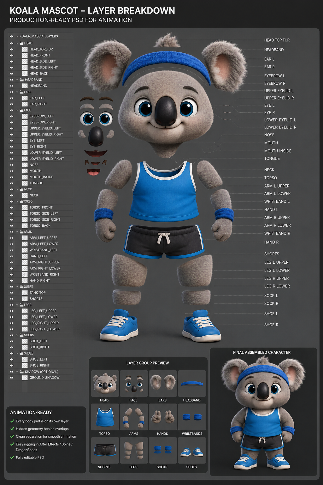

# Mascot System — Hand-off / Continuation Guide

**Read this first if you are continuing the mascot work.** It captures the
goal, the decided architecture, what is already built, and the exact next
steps — so you continue without drifting. Do not relitigate settled
decisions (see “Guardrails”).

---

## 1. The goal (do not lose this)

Make **this exact koala** live inside the iOS fitness app as a character
with **emotions that react to real user activity**, like Duolingo / Apple
Fitness. Concretely:

- 😊 Open app → smile / wave
- 😔 No workout for ~3 days → sad / tired / yawn
- 🏆 Hit a PR → jump / celebrate
- 💪 During a workout (curl) → holding a dumbbell
- 🥶 Cold weather → wearing a coat
- 🎂 Birthday → party hat

The **“soul” is the logic** (when/why it reacts) — that is the valuable
part and it is 100% code. The **art** (a picture per emotion) is generated
by the USER with an AI image tool; the AI dev does everything else.

Reference art (the character) and the current clean idle:

- Live idle asset (background removed): `native/assets/mascots/koa.png`.

---

## 2. Division of labour (the working model — agreed)

| Task | Who |
|---|---|
| Generate character art per pose/emotion (AI image tool) | **User** |
| Cut background cleanly, integrate, animate | **AI dev (you)** |
| Emotion/event logic, state machine, equipment, app wiring | **AI dev (you)** |

The user depends almost entirely on AI and cannot run GUI tools. Therefore
**all logic and asset processing must be code (no GUI in the loop).** The
only thing the user does outside code is *prompt an image generator*.

---

## 3. Architecture (decided — Principal-Architect level)

Layered, provider-abstracted “Mascot Engine”. **App never knows the render
tech.** All intelligence in TypeScript; providers are thin adapters; assets
are data (images/frames + JSON manifest).

```
App screens
  → MascotController (public API: play/setMood/setEnergy/setWorkout/equip)
    → MascotEngine (TS: state machine + mood + equipment)   ← the brain
      → IAnimationProvider (adapter)                          ← thin
        → Renderer (draws image/frames/…)
          → React Native
```

**Chosen primary provider: image / sprite-frame (raster).** Reasoning under
the “AI-only, no GUI” constraint:

- Raster assets come from AI image/video (user prompts) and are **processed
  and assembled entirely in code** (Python/PIL — see §6). Adding an
  animation = new frames + a JSON line. **No GUI ever.**
- **Rive and GLB are demoted to optional future providers.** They look
  great but are **binary formats authored only in GUI editors (Rive
  editor / Blender / Mixamo)** — the AI cannot create or modify them, so as
  a *primary* they would block development. Keep them as pluggable options
  for if/when a human/artist is available. **Do not make Rive/GLB the
  core.** (The earlier `KOA_RIG_SPEC.md` is a valid Rive brief but Rive is
  NOT the primary path.)

Provider priority already implemented in `mascot-figure.tsx`:
`Rive → image → Lottie → vector-fallback`. This is the seed of the engine;
the next step formalises it (§5).

---

## 4. What is already built (in the repo, both branches)

Branches: develop on `claude/native-logging-input-design-1ziiu3`, then
**ff-merge into `claude/ios-fitness-rebuild-omgulr`** (the user pulls
omgulr) and push BOTH. Always merge to omgulr.

Files:
- `src/components/ascnd/mascot-figure.tsx` — **provider selector**.
  Renders: **`KoaFigure`** (koa — the spec-sheet vector, see §4b) → Rive
  (if registered) → image + breathing → Lottie → `VectorMascot`.
  `ImageMascot` uses `expo-image` + a Reanimated breathing loop
  (scaleY/translateY), `contentPosition="bottom"` so feet touch floor. The
  image entries for koa are kept but no longer reached.
- `src/lib/mascot-images.ts` — **image registry** (koa live; `aspect` =
  h/w so the box matches the art). `imageFor(id, mood)` → source+aspect.
- `src/lib/mascot-lottie.ts` — Lottie registry (empty; lazy).
- `src/lib/mascot-rive.ts` + `src/components/ascnd/mascot-rive-view.tsx` —
  Rive registry + view (empty; lazy native require). Contract: SM
  `MascotSM`, number input `mood`, action triggers.
- `assets/mascots/koa.png` — clean idle (U2Net-cut, 640×859).
- `assets/mascots/README.md`, `KOA_RIG_SPEC.md`, `koa-rig-reference.png`.
- Deps installed: `expo-image` (was present), `lottie-react-native@7.3.8`,
  `rive-react-native@9.8.5` (native modules → dev build rebuild needed to
  link, but both are lazy so an empty registry never touches them).

Data the logic can already use:
- `src/hooks/use-mascot.tsx` — `useMascotMood()` returns
  `happy | neutral | tired` (happy = meals+workout logged; tired = no meal
  after noon / no workout by evening). `useMascotMessage()` context lines.
  `MASCOTS` catalog ids: `koa, blaze, swift, titan, drago, nova`.
- `src/hooks/use-mascot-room.ts` — `useDailyStreak()` (consecutive
  daily_logs), wallet/xp/level, quests.
- PR signal: `workout_sessions.pr_detected` (see `use-extras.ts` awards
  `first_pr` / `pr_5`).
- The gym scene (`mascot-scene.tsx`) already wraps the figure in event
  motion (nod/settle on `celebrateSignal`, droop + zzz when tired) and
  passes `celebrateSignal`/`flexSignal` from the room screen.

Gamification already shipped (context, don’t redo): rank ladder
(Rookie→Legend, `mascot-room.ts`), Today’s Energy ring
(`energy-ring.tsx`), Rank Journey (`rank-journey.tsx`), reward coin-burst +
rank-up confetti, room lighting reacting to rank/energy.

---

## 4b. Progress log (what shipped after this hand-off)

- **§5 Emotion Engine — DONE.** `src/lib/mascot-emotion.ts` (pure map) +
  `src/hooks/use-mascot-emotion.tsx` (one-shot store + `useMascotEmotion()`
  + `triggerMascotAction()`). Held emotion from mood/streak/hour/route
  (workout→curl, night→sleep, birthday→hat, mood→happy/tired/sad); one-shots
  wave (app-open / tap) and celebrate (award medal + mascot unlock, via the
  celebration host). `MascotFigure`/`ImageMascot` give each emotion its own
  micro-motion (celebrate bounce, curl pulse, wave sway, sad/tired/sleep
  slow-breath + slump). `hat` uses the real profile DOB; `coat` is wired but
  gated `cold:false` until a weather source (location + API) lands.
- **8 poses re-cut** (happy/sad/sleep/celebrate/curl/wave/hat/coat) — full
  fur, solid body, fully transparent. Aspects live in `mascot-images.ts`.
- **§6 background removal — DONE, reproducible:** `scripts/remove-bg.py`
  (texture-flood silhouette + band-limited matting; no ML model, works
  offline). Replaces the blocked U2Net path. See `scripts/README.md`.
- **Gym room — DONE, data-driven.** `RoomRenderer.tsx` reads
  `src/config/room/{scene,theme,user_room}.json` (+ `room-assets.ts`):
  positions / skin / placement as data, z-sorted layers, width-relative.
  Photoreal neon backdrop + background-removed props (rack/bench/plant/
  heavy-bag/stats panel) with vector fallbacks (mirror/kettlebell/barbell/
  treadmill). `MascotScene` is now a thin adapter over it.

- **Koa redrawn from the SVG spec sheet — DONE.** The sheet
  (`../assets/mascots/koa-svg-spec-sheet.png`, "KOALA MASCOT – SVG DESIGN")
  is now the character's source of truth, and §10 of it asks for exactly
  one target: **React Native SVG**. Ported in
  `src/components/ascnd/koa/`:
  - `koa-parts.ts` — §2 palette, every Bézier path, and the two lookup
    tables (`faceFlags`, `poseFlags`) that turn `expression`/`pose` into
    the set of layers to draw. Layer ids match `KOA_RIG_SPEC.md` §1.
  - `koa-anim.tsx` — the sheet's CSS `@keyframes` as Reanimated
    primitives (`Rot`/`Shift`/`Breathe`/`Blink`/`Fade`/`Flash`/`Fly`/
    `Shake`/`RunBody`). Groups animate through `matrix`, the one transform
    prop `RNSVGGroup` takes natively, so nothing crosses to JS per frame.
    Every loop is stopped unless the current state uses it — an idle Koa
    runs three.
  - `koa-figure.tsx` — the figure. All 8 expressions of §3 plus
    `happytired`, and all 5 poses of §5 (idle / chạy bộ / tập tạ / giãn cơ
    / thư giãn) including the 3/4 turn, hip-pivot leg cycle, speed lines,
    ground dust, sweat and cap that come with the run.
  - `src/lib/koa-emotion.ts` — the one table mapping Emotion Engine states
    to sheet expressions/poses. `MascotFigure` renders it for `koa` ahead
    of the pre-rendered art, so the buddy is live vector everywhere the 2D
    figure appears.
  A new `run` emotion carries the running pose; it is reachable from the
  DEV picker but not yet derived automatically in `baseEmotion()`.
- **Sheet §8 GỢI Ý ANIMATE — all four DONE.** Blink and Mouth Open/Close
  came with the port; **Look Left / Right** and **Cheek Pop** landed after.
  `useGaze()` wanders the pupils (and their highlights) in −1…1, mostly
  looking at you with a short glance every few seconds, holds randomised so
  it never reads as a loop; the gaze rests while Koa runs. `usePop()` fires
  the cheek pop — the head squashes wide onto the shoulders and both blushes
  swell — on every `pokeSignal` bump, which `StageRenderer` raises when the
  buddy is tapped (on top of the existing nod + wave).
- **CHẠY BỘ rebuilt from the sheet, not from the design component.** The
  component's running pose read as standing still, and it was faithful — the
  fault is in the component, not the port: its legs are the standing blobs
  swinging ±22° about a hip *inside* the torso, so no part of a leg ever
  leaves the silhouette, and its "cap" is an arc over the crown where the
  sheet draws a headband. Rebuilt against §5 CHẠY BỘ itself:
  - each limb is now two bones (hip → knee → ankle, shoulder → elbow →
    wrist), every joint on its own 4-key cycle — reach, stance, push-off,
    recovery — via `keyed()` / `<Swing>`. A sine cannot express a stride;
    the knee has to fold on the way through and straighten to plant.
  - near and far side run half a stride apart, and the far limbs are drawn
    behind the torso in `PALETTE.far` so the two sides never merge.
  - blue headband (`HEADBAND`) following the skull's curve — a flatter or
    wider arc instantly reads as earmuffs — plus the blue singlet, no
    shorts, bare legs, as drawn. The band covers the brow line, so the run
    hides the eyebrows, which is what the sheet shows.
  - `RUN.lean` / `RUN.bob` raise the forward lean and the stride bounce.
  All numbers live in `RUN` in `koa-parts.ts`; they were tuned by rendering
  the cycle frame-by-frame, so change them there and re-check a strip.
- **`/koa-sheet` — the character review screen.** Panels §3 and §5 of the
  sheet, live on device: all 8 expressions and all 5 poses, tap a card to
  load it into the hero, tap the hero to cycle ("chạm vào Koa để đổi biểu
  cảm", as the design's room panel does). Reached from the DEV bar in the
  Mascot Room; nothing links to it in a production build. Use it to check
  the drawing on real hardware rather than from a simulator screenshot.
- **3D removed — DONE.** With the sheet as the direction, the real-time 3D
  buddy was deleted: `mascot-3d.tsx`, `assets/mascots/koa.glb`,
  `config/mascot-{bones,face,poses}.ts`, `tools/mascot-playground`,
  `docs/MASCOT_3D_SETUP.md`, `docs/HERO_MODEL_SPEC.md`, the `glb`/`gltf`
  Metro asset extensions and the `three` / `@react-three/*` / `expo-gl`
  dependencies. `MascotBuddy` is now a thin wrapper over `MascotFigure` —
  no lazy Canvas, no error boundary, no dev fallback banners.

Still open: §7 smooth-motion (needs animated clips), `coat` weather source,
sheet §1 **turnaround** (side + back views — the sheet shows them, no path
data exists for them yet), and app states for the sheet's `surprised` /
`angry` expressions.

---

## 5. NEXT STEPS — build the Emotion Engine (primary task) — ✅ DONE (see §4b)

Goal: a small TS engine that maps **real app state/events → a mascot
emotion/action**, rendered via the image provider, and degrading
gracefully (1 still per emotion + micro-motion is enough; swap in animated
WebP later for smooth actions).

### 5a. Emotion state model
Emotions/actions (start): `idle, happy, sad, tired/sleep, celebrate, curl,
wave`. Each maps to an image key in `mascot-images.ts` (fall back to
`idle` when the art isn’t added yet — so it works incrementally).

Extend `MascotImageSet` to hold these keys, e.g.:
```ts
{ idle, happy?, sad?, tired?, sleep?, celebrate?, curl?, wave?, coat?, hat?, aspect }
```
`imageFor(id, emotion)` returns the specific art or `idle`.

### 5b. Event → emotion mapping (the brain)
Create `src/lib/mascot-emotion.ts` (pure functions) + a hook
`useMascotEmotion()` that derives the current emotion from data:

| Trigger | Source (exists?) | Emotion |
|---|---|---|
| App/room opened | mount | `happy` (brief) → `idle` |
| Streak lapse ≥3 days / mood tired | `useDailyStreak`, `useMascotMood` | `sad`/`tired` |
| Recent PR | `workout_sessions.pr_detected` / new award | `celebrate` (one-shot) |
| On workout log / curl screen | route = `log-workout` (or exercise name) | `curl` |
| Night / no activity late | hour + logs | `sleep` |
| Cold weather | ⚠️ needs weather API + location | overlay `coat` |
| Birthday | ⚠️ needs `birthdate` (add to profile/settings) | overlay `hat` |

First 4 use **existing** data. Weather + birthday need a small data add
(free weather API by location; a birthdate field in settings) — do those
when you reach outfits.

### 5c. Playback / state machine (TS, code-only)
`src/lib/mascot-state-machine.ts`:
- Base loop = `idle`, blended by mood (`happy`/`sad`/`tired` idle variant).
- One-shot actions (`celebrate`, `curl`, `wave`) play then auto-return to
  the mood idle. Held state = `sleep` (until mood changes).
- Micro-motion per still (breathe always; squash on celebrate/jump;
  slump on sad) via Reanimated in the renderer.
- Face blink can be a timed overlay later (or a `blink` art frame).

### 5d. Renderer
Evolve `ImageMascot` (in `mascot-figure.tsx`) to accept an `emotion` and
pick per-emotion micro-motion. Keep `expo-image`. Later add a
`SpriteRenderer` for multi-frame WebP/sprite clips (see §7).

### 5e. Wire it
- `MascotFigure` already receives `mood`; add `emotion`/`action` from the
  engine (a context `MascotProvider` at root, or thread props).
- Fire `celebrate` on reward/PR (room already has `celebrateSignal`), set
  `sleep`/`sad` from mood, `curl` when on the workout logging flow.

**Ship incrementally:** with only `koa.png` today you can already do
mood-driven micro-motion (breathe/slump/bounce). Each new art file lights
up its emotion automatically.

---

## 6. Asset processing pipeline (background removal) — ✅ DONE: `scripts/remove-bg.py`

The user sends raw AI images with a **plain flat light-grey background**,
full body, front view (like the koala). Cut them with **U2Net matting** (NOT
colour-key flood-fill — that chews fur and leaves grey fringe).

Setup (ephemeral container — re-fetch each session):
```bash
python3 -m pip install --quiet numpy Pillow onnxruntime
# model (GitHub release is 403-blocked; use the HF mirror):
mkdir -p ~/.u2net && curl -fsSL -o ~/.u2net/u2net.onnx \
  "https://huggingface.co/tomjackson2023/rembg/resolve/main/u2net.onnx"
```

Cut script (`cut.py`) — soft fur alpha, defringe, crop, resize:
```python
import numpy as np, onnxruntime as ort
from PIL import Image, ImageFilter
SRC='in.png'; OUT='out.png'; TW=640   # target width
im=Image.open(SRC).convert('RGB'); W,H=im.size
sess=ort.InferenceSession('/root/.u2net/u2net.onnx',providers=['CPUExecutionProvider'])
n=sess.get_inputs()[0].name
r=im.resize((320,320),Image.BILINEAR)
x=(np.asarray(r).astype(np.float32)/255.0-[0.485,0.456,0.406])/[0.229,0.224,0.225]
x=x.transpose(2,0,1)[None].astype(np.float32)
m=sess.run(None,{n:x})[0][0,0]
m=(m-m.min())/(m.max()-m.min()+1e-8)
a=np.asarray(Image.fromarray((m*255).astype(np.uint8),'L').resize((W,H),Image.BILINEAR)).astype(np.float32)/255.
a=np.clip((a-0.06)/0.88,0,1)                      # crisp transition, kill haze
arr=np.asarray(im).astype(np.float32); af=a[...,None]
pb=np.stack([np.asarray(Image.fromarray((arr*af)[...,c].astype(np.uint8),'L').filter(ImageFilter.GaussianBlur(2.5))).astype(np.float32) for c in range(3)],-1)
ab=np.asarray(Image.fromarray((a*255).astype(np.uint8),'L').filter(ImageFilter.GaussianBlur(2.5))).astype(np.float32)[...,None]
rgb=np.where(af>0.9,arr,pb/np.clip(ab,1,None))    # defringe: edge = fur colour
o=Image.fromarray(np.dstack([np.clip(rgb,0,255).astype(np.uint8),(a*255).astype(np.uint8)]),'RGBA')
o=o.crop(Image.fromarray((a*255).astype(np.uint8),'L').getbbox())
o=o.resize((TW,round(o.size[1]*TW/o.size[0])),Image.LANCZOS); o.save(OUT)
print('aspect h/w =', round(o.size[1]/o.size[0],4))
```
Always verify on a magenta background (fringe/jaggies show there) before
committing. Save to `assets/mascots/koa-<emotion>.png`; register in
`mascot-images.ts` with the printed aspect.

---

## 7. Smooth motion (optional upgrade, still code-only)
For truly animated actions (curl up/down, jump): user makes a short clip
with **image-to-video AI** (Kling/Luma/Runway/Pika) → you extract frames,
U2Net-cut each, assemble an **animated WebP / APNG (transparent)** or a
sprite sheet + JSON, play via `expo-image` (animated) or a `SpriteRenderer`
that drives the frame index. This stays 100% code/asset — no GUI.

---

## 8. Asset shopping list (what to ask the user for)
Same character, same outfit/colors, full body, front, **plain grey bg**,
one character. Base prompt + one action line each. Filenames:

Priority 1 (turns the engine on): `koa-happy.png` (smiling),
`koa-sad.png` (sad/tired), `koa-celebrate.png` (jumping, arms up),
`koa-curl.png` (holding a dumbbell, bicep curl).
Priority 2: `koa-wave.png`, `koa-sleep.png` (eyes closed).
Priority 3 (outfits, full variants for v1): `koa-coat.png`, `koa-hat.png`.

1 still per emotion is enough to start. The user attaches files (inline
paste does NOT persist to disk — must be a file attachment).

---

## 9. Guardrails (settled — do NOT drift)
- ~~Do NOT hand-draw the character in SVG/code~~ — **REVERSED by the user
  (2026-07-26).** The direction is now the flat-vector spec sheet
  (`assets/mascots/koa-svg-spec-sheet.png`), whose §10 names React Native
  SVG as the target. Koa is code-drawn in `components/ascnd/koa/`. Do not
  reintroduce a photoreal/AI-image Koa to “add volume”.
- **The 3D path is GONE, on purpose.** `mascot-3d.tsx`, `koa.glb`, the bone/
  pose/face configs, the Three.js rig playground and the
  react-three-fiber / expo-gl / three dependencies were all removed at the
  user’s request. Do not add them back; the stage is being redesigned
  around the vector character.
- **Do NOT make Rive the primary** — GUI-authored binaries block an
  AI-only workflow. It stays an optional provider (registry is empty).
- **Do NOT bake clothing into animations** — outfits are overlays/variants
  swapped independently.
- **Keep all logic in TypeScript**, providers thin, assets as data.
- **Background removal = U2Net matting** (§6), not colour-key.
- Typecheck before commit: `cd native && npx tsc --noEmit` (ignore the
  pre-existing TS5101 baseUrl warning). Commit + push BOTH branches;
  always ff-merge into `claude/ios-fitness-rebuild-omgulr`.
- Commit trailer: `Co-Authored-By: Claude Fable 5 <noreply@anthropic.com>`
  and the Claude-Session line. Never put the model id in commits.

---

## 10. One-paragraph summary for a fresh model
The user generates AI images of one koala mascot in different emotions; you
cut them with U2Net (§6) and build a **TypeScript Emotion Engine** (§5)
that maps real app events (streak lapse, PR, workout, mood) to an emotion,
rendered via the image provider in `mascot-figure.tsx` with per-emotion
micro-motion, degrading to the current `koa.png` idle + the vector fallback
when art is missing. Raster (image/sprite) is the intended primary because
it’s the only high-quality path an AI can produce and maintain without a
GUI; Rive/GLB are optional future providers, not the core. Start by wiring
mood-driven micro-motion today, then light up each emotion as its art
arrives, then add weather (coat) and birthday (hat) with a small data add.
```
